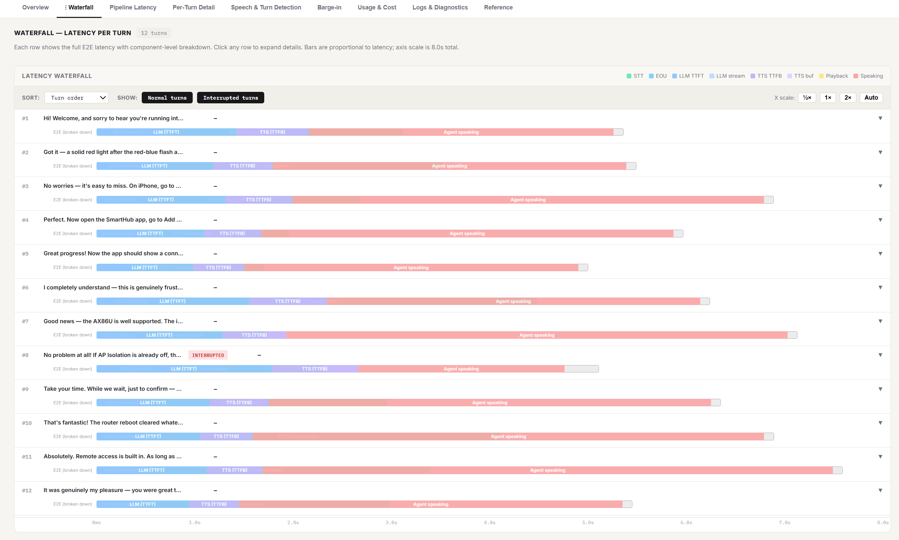

# LiveKit Agent · Latency Dashboard

A zero-dependency, single-file HTML dashboard for analysing end-to-end and component-level latency of calls made with [LiveKit Agents](https://docs.livekit.io/agents/). Drop your exported JSON files in, or connect your LiveKit Cloud account to pull data directly.



---

## Features

| Feature | Details |
|---|---|
| **Waterfall view** | Per-turn timeline showing STT → EOU → LLM → TTS → Playback → Speaking, proportionally scaled and colour-coded |
| **Pipeline percentiles** | P50/P75/P90/P95 breakdown for every latency component |
| **Per-turn detail** | E2E, LLM TTFT, TTS TTFB, playback, tokens, response text |
| **Speech & turn detection** | STT confidence, transcription delay, EOU probability per user turn |
| **Barge-in analysis** | Interruption detection delay, stop delay, probability |
| **Usage & cost** | Token counts, TTS characters, STT audio per turn |
| **Logs & diagnostics** | Full log stream with warnings highlighted |
| **Multi-call aggregation** | Load multiple sessions, compare individually or aggregate across all |
| **LiveKit Cloud sync** | Connect with API key + secret, browse rooms, auto-load OTEL exports |
| **Zero dependencies** | Pure HTML/CSS/JS — no build step, no server, no npm |

---

## Quick Start

### Option A — File upload (offline / local files)

1. Download [`index.html`](index.html) and open it in any modern browser.
2. Drag-and-drop your exported JSON files:
   - `traces.json` — OpenTelemetry traces (primary source)
   - `metrics.json` — OpenTelemetry metrics
   - `logs.json` — OpenTelemetry logs
   - `chat_history.json` — LiveKit Agents chat history export
3. Files are automatically classified and matched by room ID.

You can load files from multiple calls at once. Switch between sessions using the room pills at the top, or click **⊕ All Calls** to aggregate all loaded sessions.

### Option B — LiveKit Cloud direct integration

1. Open the dashboard.
2. Click **Connect LiveKit Cloud** in the top-right.
3. Enter:
   - Your LiveKit Cloud URL (e.g. `https://your-project.livekit.cloud`)
   - API Key and API Secret (from **Console → Settings → Keys**)
4. The dashboard lists your recent rooms. Click **Fetch data** to pull egress exports and participant metadata.

> **Security note:** Your API secret is stored only in the browser tab's memory. It is never sent to any server other than your own LiveKit Cloud project URL. Do not use this dashboard on a shared or public machine.

---

## How to export JSON files from LiveKit Cloud

LiveKit Agents emit OpenTelemetry data when you configure an OTEL exporter. The easiest way to capture all four file types:

```python
# In your agent entrypoint, before WorkerOptions:
from livekit.agents import WorkerOptions, cli
from opentelemetry.exporter.otlp.proto.http.trace_exporter import OTLPSpanExporter
from opentelemetry.sdk.trace.export import SimpleSpanProcessor

# Point to a local collector or export to files
# See: https://docs.livekit.io/agents/observability/
```

Or export directly to JSON files using the [otel-cli](https://github.com/equinix-labs/otel-cli) or a local OpenTelemetry Collector with a `file` exporter.

Full observability setup guide: [docs.livekit.io/agents/observability](https://docs.livekit.io/agents/observability/)

---

## Waterfall View

The **⫶ Waterfall** tab shows, for every agent turn in a call:

```
Turn #3  "Let me check that for you…"                    E2E: 843 ms
──────────────────────────────────────────────────────────────────
[STT ████][EOU ██][LLM TTFT ██████][LLM stream ████][TTS ███]···
                                                          ^
                                              Agent starts speaking
```

- Each horizontal bar is proportional to real wall-clock time.
- Bars are colour-coded by component (see legend).
- Click any row to expand and see individual component durations with precise ms values.
- Use the **Sort** dropdown to find your slowest turns instantly.
- The **X scale** buttons let you zoom in to see short-latency calls more clearly.
- Filter by **Normal** vs **Interrupted** turns.

### Component colour key

| Colour | Component |
|---|---|
| 🟢 Green | STT transcription |
| 🔵 Sky blue | EOU detection |
| 🔵 Blue | LLM TTFT |
| 🔵 Light blue | LLM streaming |
| 🟣 Violet | TTS TTFB |
| 🟣 Lavender | TTS buffering |
| 🟡 Yellow | Playback latency |
| 🔴 Red | Agent speaking |

---

## Latency Thresholds

| Component | Excellent | Good | Acceptable | Warning | Critical |
|---|---|---|---|---|---|
| E2E Latency | ≤500 ms | ≤1000 ms | ≤1500 ms | ≤2500 ms | >2500 ms |
| LLM TTFT | ≤300 ms | ≤600 ms | ≤1000 ms | ≤1500 ms | >1500 ms |
| TTS TTFB | ≤200 ms | ≤400 ms | ≤700 ms | ≤1000 ms | >1000 ms |
| Playback latency | ≤100 ms | ≤300 ms | ≤700 ms | ≤1200 ms | >1200 ms |
| STT transcription | ≤200 ms | ≤350 ms | ≤500 ms | ≤700 ms | >700 ms |
| EOU detection | ≤300 ms | ≤600 ms | ≤900 ms | ≤1500 ms | >1500 ms |
| Barge-in stop | ≤200 ms | ≤400 ms | ≤700 ms | ≤1000 ms | >1000 ms |

---

## Data Source Map

| Metric | Primary source | Secondary |
|---|---|---|
| E2E latency | `chat_history.json` | — |
| LLM TTFT | `chat_history.json` | `traces.json` |
| TTS TTFB | `chat_history.json` | `traces.json` |
| Playback latency | `chat_history.json` | — |
| STT transcription delay | `chat_history.json` | `traces.json` |
| EOU delay | `chat_history.json` | `traces.json` |
| Barge-in stop delay | `traces.json` | — |
| STT confidence | `traces.json` | `chat_history.json` |
| Token counts | `traces.json` | `metrics.json` |
| TTS characters | `metrics.json` | — |
| Connection acquire | `metrics.json` | — |
| Disconnect reason | `logs.json` | — |

---

## Compatibility

- Chrome 90+, Firefox 90+, Safari 15+, Edge 90+
- No internet connection required for file-upload mode
- LiveKit Cloud mode requires internet and a valid API key
- Tested with LiveKit Agents SDK 0.10+

---

## Repository Structure

```
livekit-latency-dashboard/
├── index.html          # The entire dashboard (single file)
└── README.md           # This file
```

The dashboard is intentionally a single HTML file so it can be:
- Opened directly from a file system with no server
- Shared as a single file attachment
- Hosted on GitHub Pages with zero configuration

---

## Hosting on GitHub Pages

1. Fork or clone this repository.
2. Go to **Settings → Pages**.
3. Set Source to **Deploy from a branch → main → / (root)**.
4. Your dashboard is live at `https://<your-username>.github.io/<repo-name>/`.

No build step. No CI needed.

---

## Contributing

Issues and PRs welcome. The dashboard is intentionally kept as a single file to eliminate all build complexity. If you add a feature, keep it within `index.html`.

---

## License

MIT — do whatever you want with it. A star on the repo is appreciated if it helps you.
